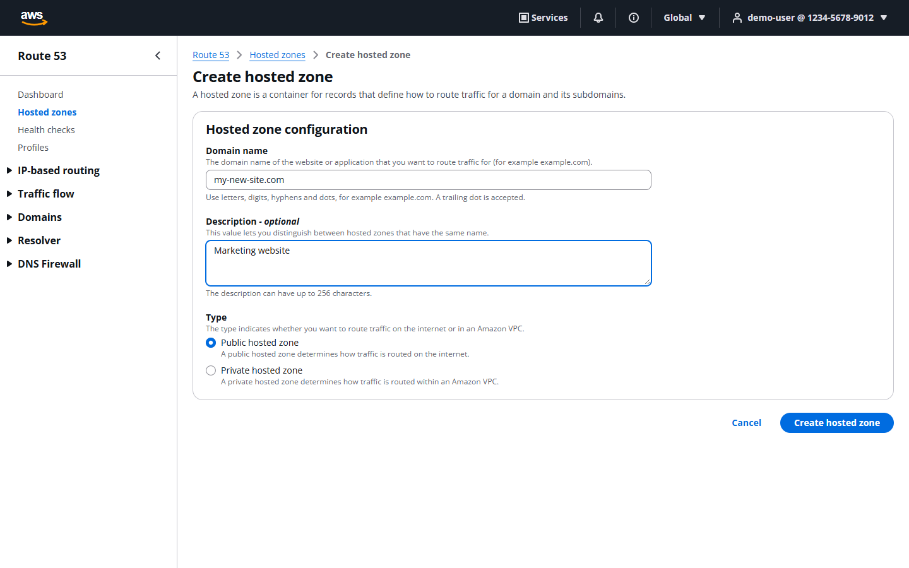
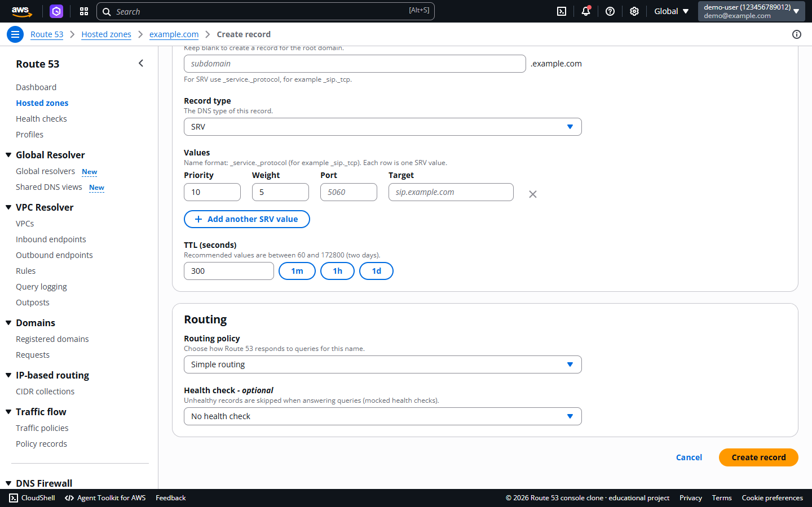
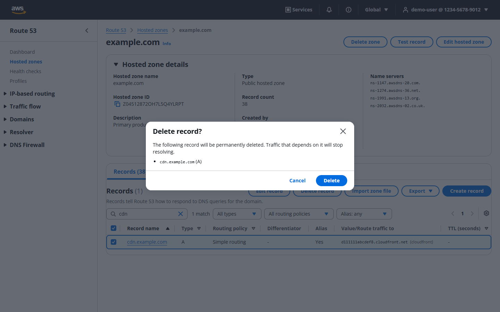
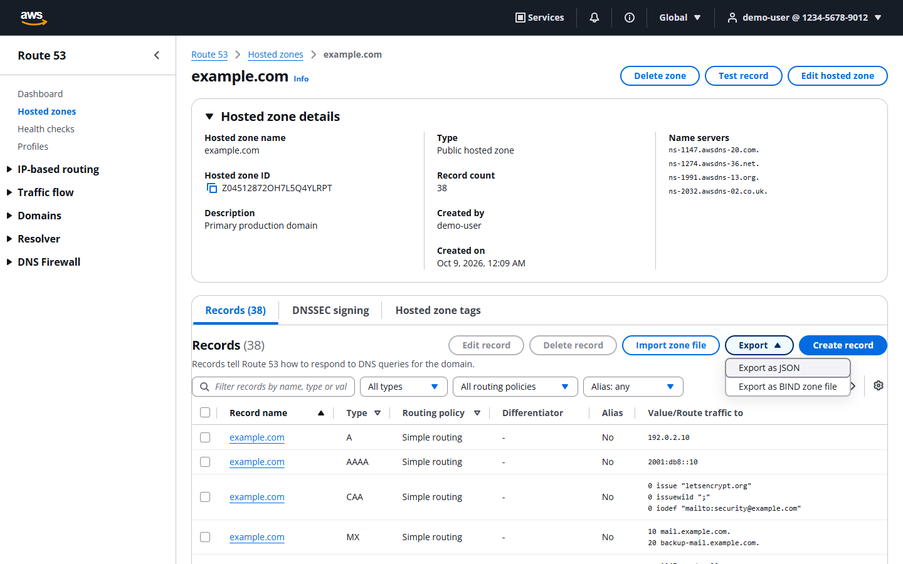
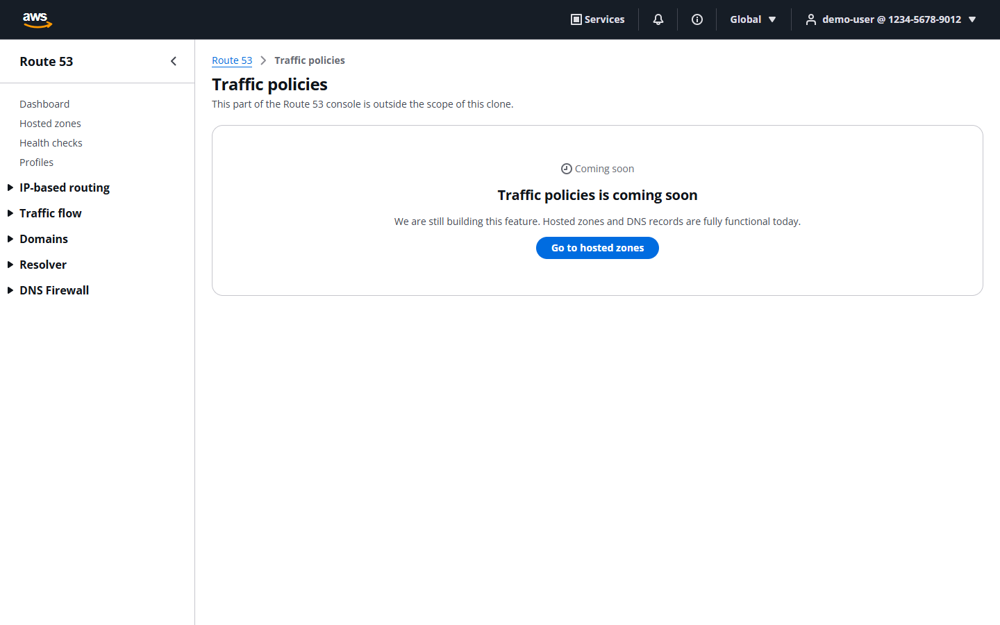

# AWS Route 53 Console Clone

A functional clone of the **AWS Route 53 management console**: hosted zones, DNS records for nine record types, routing policies, BIND import/export, bulk operations and a DNS query simulator. It reproduces the console's look and workflows rather than real DNS: the UI is built with [Cloudscape](https://cloudscape.design) (the open-source design system AWS uses for its console), with a FastAPI + SQLite backend behind it.

| | |
|---|---|
| **Demo login** | `demo@example.com` / `password` |
| **Hosted demo** | _Pending: see [HUMAN_ACTIONS_REQUIRED.md](HUMAN_ACTIONS_REQUIRED.md). Deployment needs your GitHub/Render/Vercel accounts._ |
| **Stack** | Next.js 16 (TypeScript) · FastAPI · SQLAlchemy 2 · SQLite |


## Contents
1. [Features](#features) · 2. [Screenshots](#screenshots) · 3. [UI/UX approach](#uiux-approach) · 4. [Architecture](#architecture) · 5. [Folder structure](#folder-structure) · 6. [Local setup](#local-setup) · 7. [Environment variables](#environment-variables) · 8. [Database schema](#database-schema) · 9. [API overview](#api-overview) · 10. [DNS records & validation](#dns-records--validation) · 11. [Routing policies](#routing-policies) · 12. [DNS simulator](#dns-simulator) · 13. [BIND import / export](#bind-import--export) · 14. [Testing](#testing) · 15. [Deployment](#deployment) · 16. [Known limitations](#known-limitations) · 17. [Future improvements](#future-improvements)

## Features
**Assignment scope**
- Mocked authentication: login, logout, persistent session (opaque token in an `HttpOnly` cookie, bcrypt password hash, server-side revocation), route protection.
- **Hosted zones** (public and private): list, search, filter by type, sort, server-side pagination, create, edit description, delete. Creating a zone generates deterministic **SOA** and **NS** system records.
- **DNS records**: create / view / search / edit / delete for **A, AAAA, CNAME, TXT, MX, NS, PTR, SRV, CAA**, with one dynamic editor that changes with the record type (structured rows for MX, SRV and CAA).
- Route 53 look and feel: top navigation, collapsible service navigation, breadcrumbs, flashbar notifications, tables with selection/sorting/preferences, modals, empty/loading/error states.
- Placeholder pages (Coming Soon) for Traffic policies, Health checks, Resolver, Profiles and the other navigation entries; a small real Dashboard.

**Bonus items implemented**
- BIND zone-file **import** (upload or paste → parse → preview with per-line errors → confirm) and **export** as JSON or BIND.
- **Dark mode** (persisted), **keyboard shortcuts** (`/` search, `c` create, `g d`, `g h`, `?` help), **bulk delete** of records.

**Beyond the brief**
- Alias records (CloudFront, ELB, S3 website, API Gateway, another record) and six **routing policies**: simple, weighted, latency, failover, geolocation, multivalue.
- A **DNS resolution simulator** ("Test record") that answers queries from the stored records.
- Alembic migration, Docker setup, 68 backend tests and Playwright end-to-end tests.

## Screenshots
| | |
|---|---|
|  Login |  Dashboard |
|  Hosted zones |  Create hosted zone |
|  Create A record |  Create MX record |
|  SRV editor |  CAA editor |
|  Routing policy fields |  Search + filter |
|  Delete confirmation |  BIND import preview |
|  Export menu |  Coming Soon page |
|  DNS simulator |  Dark mode |

Regenerate them with `npm run screenshots` (in `frontend/`).

## UI/UX approach
The assignment asks for a look and feel "exactly the same" as Route 53, so the UI uses **Cloudscape** (`@cloudscape-design/components`), the same component library as the real console, instead of approximating it with custom CSS. Page structure follows the console:

- **Shell**: dark top navigation (AWS logo, Services, account menu with sign-out and theme toggle), "Route 53" side navigation, breadcrumbs.
- **Hosted zones**: sticky header with count and `View details / Edit / Delete / Create hosted zone`, filter box, type filter, radio selection, pagination and column/page-size preferences.
- **Zone detail**: expandable details panel (ID, type, name servers, record count), tabs, records table with the console's columns (Record name, Type, Routing policy, Differentiator, Alias, Value/Route traffic to, TTL, Health check ID, Evaluate target health, Record ID).
- **Forms** use Cloudscape `Form`/`FormField` with labels, descriptions, constraint text and field-level errors. **Destructive dialogs** name the target; deleting a zone needs typing `delete`.

Our own code is the feature layer: dynamic record editor, validation, URL-synced table state, data fetching, resolver UI and the backend.

## Architecture
```
Browser ──► Next.js (React, Cloudscape, TanStack Query, React Hook Form + Zod)
              │  /api/*  (Next.js rewrite → same-origin, first-party cookie)
              ▼
           FastAPI ── routers → services → repositories → SQLAlchemy ── SQLite
                         │          │
                         │          └ dns/validators.py (pure DNS rules)
                         └ Pydantic schemas, uniform error contract
```
- **Backend layers**: `api/routers` (HTTP only) → `services` (business rules: conflicts, system records, import, resolver) → `repositories` (query building: search, filter, sort, pagination) → `models`. DNS rules live in a dependency-free module (`app/dns/validators.py`).
- **Frontend**: App Router pages stay thin; logic lives in `features/*` (hooks wrapping TanStack Query, components). Table state (search, filters, sort, page, page size) is stored in the URL, so views are shareable and survive reload/back. Search is debounced (300 ms).
- **Validation twice**: `lib/dns-validation.ts` + `lib/record-schema.ts` (Zod) give instant feedback; the backend re-validates everything and returns field-level errors that the form maps back onto inputs.
- **Error contract**: every error is `{"detail": "message", "errors": [{"field", "message"}]}` with 401/403/404/409/422; stack traces never reach the client.
- **Record storage**: one row per Route 53 *resource record set* (`name + type + set identifier`) with `values` as a JSON list of canonical presentation strings (`10 mail.example.com.`, `0 issue "letsencrypt.org"`). Routing and alias settings are real columns. This mirrors Route 53's own API, keeps a single table instead of nine, and `parsed_values` in responses gives the structured form (`{priority, exchange}`) for editors.

## Folder structure
```
backend/
  app/
    api/ (deps.py, routers/)   core/ (config, security, errors)   db/ (engine, Base)
    models/  schemas/  repositories/  services/  dns/ (constants, validators)  seed.py  main.py
  alembic/ (initial migration)   tests/   Dockerfile   pyproject.toml
frontend/
  src/app/ (login, (console)/dashboard, hosted-zones/..., [section] coming-soon)  src/proxy.ts
  src/components/ (layout, common, states)   src/features/ (auth, hosted-zones, records, dns)
  src/hooks/  src/lib/ (api, dns-validation, record-config, record-schema)  src/types/
  e2e/ (Playwright)   Dockerfile
docs/screenshots/   deployment/DEPLOYMENT.md   docker-compose.yml   render.yaml   .env.example
```

## Local setup
Prerequisites: Python 3.11+, Node 20+ (tested on 24).

```bash
# 1) Backend  (http://localhost:8000, interactive docs at /api/docs)
cd backend
python -m venv .venv
.venv/Scripts/activate        # Windows (macOS/Linux: source .venv/bin/activate)
pip install -r requirements.txt
uvicorn app.main:app --reload --port 8000     # creates the SQLite DB and demo data on first start
```
```bash
# 2) Frontend  (http://localhost:3000)
cd frontend
npm install
npm run dev
```
Sign in with `demo@example.com` / `password`.

Reset the database: `cd backend && python -m app.seed --reset`.

**Docker:** `docker compose up --build` → http://localhost:3000 (data kept in the `db-data` volume; verified: login through the proxy works and a created zone survives a backend restart).

## Environment variables
See [`.env.example`](.env.example). Defaults work for local development.

| Variable | Where | Purpose |
|---|---|---|
| `DATABASE_URL` | backend | SQLAlchemy URL (default `sqlite:///backend/route53.db`) |
| `SECRET_KEY` | backend | Secret for the deployment (set a random value in production) |
| `COOKIE_SECURE` | backend | `true` over HTTPS |
| `CORS_ORIGINS` | backend | Allowed browser origins |
| `SEED_ON_START` | backend | Create tables + demo data on startup |
| `BACKEND_URL` | frontend (build time) | Target of the `/api/*` rewrite |

## Database schema
SQLite, foreign keys enforced (`PRAGMA foreign_keys=ON`). Migration: `backend/alembic/versions/`.

| Table | Purpose | Key columns |
|---|---|---|
| `users` | Mock accounts | `email` (unique), `password_hash` (bcrypt), `display_name`, `account_id` |
| `sessions` | Server-side sessions | `token_hash` (SHA-256, unique), `user_id → users` (cascade), `expires_at` |
| `hosted_zones` | Zones | `zone_id` (unique, `Z…`), `name`, `is_private`, `comment`, `record_count`, `created_by`, timestamps; unique `(name, is_private)` |
| `vpc_associations` | Mocked VPCs for private zones | `hosted_zone_id → hosted_zones` (cascade), `vpc_id`, `region` |
| `mock_health_checks` | Mock health checks (drive failover / multivalue) | `health_check_id` (unique), `status` HEALTHY/UNHEALTHY |
| `dns_records` | Resource record sets | `hosted_zone_id → hosted_zones` (cascade), `name`, `type`, `ttl`, `values` (JSON), routing columns (`routing_policy`, `set_identifier`, `weight`, `region`, `failover`, `geo_*`), alias columns (`alias_target`, `alias_target_type`, `alias_hosted_zone_id`, `evaluate_target_health`), `health_check_id → mock_health_checks` (set null), `is_system` |

Indexes: `hosted_zones(zone_id, name)`, `dns_records(type)`, `dns_records(hosted_zone_id, name, type)`; unique `dns_records(hosted_zone_id, name, type, set_identifier)`. `record_count` is a maintained counter so the zone list needs no join.

**System records.** Creating a zone adds an apex `NS` (four `ns-N.awsdns-NN.{com,net,org,co.uk}.` servers) and `SOA`, derived deterministically from the zone ID, flagged `is_system`. They cannot be deleted (403); you may change their TTL/values but not name, type or routing. A zone that still has other records can only be deleted after explicit acknowledgement (`?force=true`), like Route 53's "zone not empty" rule.

## API overview
Interactive documentation: `GET /api/docs` (OpenAPI). All endpoints except login need the session cookie.

| Method & path | Description |
|---|---|
| `POST /api/auth/login` · `POST /api/auth/logout` · `GET /api/auth/me` | Session management |
| `GET /api/hosted-zones` | `q`, `type`, `sort` (name/type/record_count/created_at/comment), `order`, `page`, `page_size` → `{items,total,page,page_size,pages}` |
| `POST /api/hosted-zones` | Create (public/private, optional VPC) |
| `GET / PUT / DELETE /api/hosted-zones/{id}` | `{id}` is the zone ID or numeric id; `PUT` edits the description; `DELETE ?force=true` |
| `GET /api/hosted-zones/{id}/records` | `q` (name/type/value/record ID), `type`, `routing_policy`, `alias`, `sort`, `order`, `page`, `page_size` |
| `POST /api/hosted-zones/{id}/records` | Create record |
| `POST /api/hosted-zones/{id}/records/bulk-delete` | `{ids: []}`; system records are skipped and reported |
| `GET / PUT / DELETE /api/records/{id}` | Read, update, delete one record |
| `POST /api/hosted-zones/{id}/import` | BIND import; `dry_run` previews, `skip_invalid` allows partial import |
| `GET /api/hosted-zones/{id}/export?format=json\|bind` | File download |
| `GET /api/dns/resolve?name=&type=` | DNS simulator (`client_region`, `client_country`, `client_continent`, `view`, `seed`) |
| `GET /api/health-checks` · `PATCH /api/health-checks/{id}` | Mock health checks / toggle status |
| `GET /api/dashboard/summary` · `GET /api/vpcs` · `GET /api/health` | Dashboard counts, mock VPC list, liveness |

Record payload example:
```json
{ "name": "_sip._tcp", "type": "SRV", "ttl": 300,
  "values": ["10 60 5060 sip.example.com"],
  "routing_policy": "weighted", "set_identifier": "blue", "weight": 70 }
```

## DNS records & validation
| Type | Accepted value | Notes |
|---|---|---|
| A / AAAA | IPv4 / IPv6 (normalised, e.g. `2001:0db8::1` → `2001:db8::1`) | one per line |
| CNAME | host name | single value; not at the apex; cannot coexist with other types at the name |
| TXT | raw text, or one or more `"quoted"` strings | quoting/escaping handled; raw text >255 chars split automatically; quoted strings ≤255 each |
| MX | `priority host` (0–65535) | multiple values |
| NS | host names | multiple values |
| PTR | host name | |
| SRV | `priority weight port target` (each 0–65535) | name like `_sip._tcp` |
| CAA | `flags tag "value"` | flags 0–255, tag `issue` / `issuewild` / `iodef` |

Rules enforced on both client and server: label/name length (63/253), wildcard only as the leftmost label, names must belong to the zone, relative / `@` / absolute names accepted, TTL 0–2147483647, unsupported types rejected, duplicate values rejected. **Conflicts (409):** duplicate name/type/record ID, CNAME exclusivity, mixed routing policies for one name+type, duplicate failover role / latency region / geolocation target.

## Routing policies
| Policy | Required fields | Rules |
|---|---|---|
| Simple | none | no record ID |
| Weighted | record ID, weight 0–255 | |
| Latency | record ID, AWS region | one record per region |
| Failover | record ID, PRIMARY or SECONDARY | one of each; optional health check |
| Geolocation | record ID, continent **or** country (or `*` default), optional US state | one record per location |
| Multivalue | record ID | one value per record |

**Alias records** (A, AAAA, CNAME): target type CloudFront, ELB, S3 website, API Gateway or another record in the zone (must exist), plus *evaluate target health*. Alias records have no TTL or values.

## DNS simulator
`GET /api/dns/resolve` (UI: zone → **Test record**) finds the most specific hosted zone, then applies the DNS lookup order to the stored records: exact match → CNAME chase (up to 8) → wildcard (only if the name has no records) → routing policy → alias.

- **Weighted:** random choice proportional to weight (weight 0 excluded; deterministic with `seed`). The UI's *Sample 20 queries* shows the distribution.
- **Failover:** PRIMARY while its (mock) health check is healthy, otherwise SECONDARY. Toggle health with `PATCH /api/health-checks/{id}`.
- **Latency:** closest to `client_region` (same region, then same continent).
- **Geolocation:** subdivision → country → continent → default.
- **Multivalue:** up to 8 healthy records.
- Responses include `rcode` (`NOERROR`, `NXDOMAIN`, `REFUSED`…), `answers`, the chosen record and a human-readable `trace`. Aliases to AWS services return deterministic **simulated** addresses.

## BIND import / export
**Import** (`Hosted zone → Import zone file`): paste or upload (≤1 MB) → *Preview import* (nothing saved; each row shows Valid/Error/Skipped with line number and reason) → *Import*. The import is all-or-nothing unless *Skip invalid records* is ticked.

Supported: `$ORIGIN`, `$TTL` (including `1h`, `2d`), `@`, relative and absolute names, blank owner (repeats the previous), optional TTL and `IN`, parenthesised multi-line values, `;` comments, quoted TXT strings; A, AAAA, CNAME, TXT, MX, NS, PTR, SRV, CAA. Rows for the same name+type merge into one record. SOA and apex NS are skipped (managed by Route 53).
Not supported: `$INCLUDE`, `$GENERATE`, classes other than `IN`, DNSSEC types.

**Export:** JSON (zone metadata + every record with structured values) or a BIND zone file. Alias records cannot be expressed in BIND and are emitted as comments; routing details are added as trailing comments.

## Testing
```bash
cd backend && pytest -q            # 68 tests
cd backend && ruff check app tests
cd frontend && npm run typecheck && npm run lint
cd frontend && PW_CHANNEL=chrome npm run test:e2e   # Playwright; omit PW_CHANNEL to use bundled Chromium (npx playwright install chromium)
```
- **Backend (pytest, isolated SQLite file):** login/logout/auth protection, zone CRUD, SOA/NS creation, all nine record types (valid and invalid values), name rules, TXT quoting, CNAME and duplicate conflicts, system-record protection, every routing policy and alias rule, search/filter/sort/pagination, bulk delete, BIND import/export round-trip, resolver behaviour for every policy, validators and seed data.
- **E2E (Playwright, production build on separate ports and a throw-away DB):** login → zone filtering/pagination → create zone (with validation error) → verify SOA/NS → create A, CNAME, MX, TXT → server-side validation error → edit → search and filter records → delete with confirmation → logout → redirect to login → login → data persisted → delete zone; BIND import preview, export download and test record; unauthenticated redirect and Coming Soon page.

## Deployment
Target: **Vercel** (frontend) + **Render free web service** (API) + **Turso** (hosted SQLite for persistence), all free. Step-by-step instructions and the one hosting caveat are in [`deployment/DEPLOYMENT.md`](deployment/DEPLOYMENT.md); the account-bound steps are listed in [`HUMAN_ACTIONS_REQUIRED.md`](HUMAN_ACTIONS_REQUIRED.md). The browser only talks to the Vercel origin (`/api/*` is rewritten to the API), so the session cookie stays first-party.

## Known limitations
- **Hosted durability depends on Turso.** Render's free plan has no persistent disk, so without a Turso database the SQLite file is recreated and re-seeded on every restart. With Turso (free, SQLite-compatible; see the deployment guide) data persists. The backend test suite passes on the libSQL driver, but remote Turso itself has not been exercised yet. Locally and with Docker, data persists on a volume.
- Free Render services sleep when idle; the first request can take up to a minute.
- Mocked on purpose: authentication (one demo user), IAM/accounts/billing, VPCs, health checks (status is a toggle, nothing is probed), AWS alias targets (simulated addresses). This is not an authoritative DNS server.
- Out of scope (Coming Soon pages): traffic policies, health-check management, Resolver, profiles, registered domains, DNS Firewall, DNSSEC and tags.
- Route 53 allows only a zone's description to be edited, so that is all "Edit" changes; a record's name and type are read-only when editing (delete and recreate to change them).
- Hosted-zone search uses a text filter plus a type dropdown rather than the console's property filter.
- Only a mock list of 22 countries is offered for geolocation.

## Future improvements
- Durable hosted database (managed SQLite-compatible service or a mounted disk).
- Traffic policies editor, health-check management with a background prober, query logging.
- "Add another record" batch creation on the record form.
- Bulk edit (TTL) alongside bulk delete.
- Server-sent progress for large imports.
